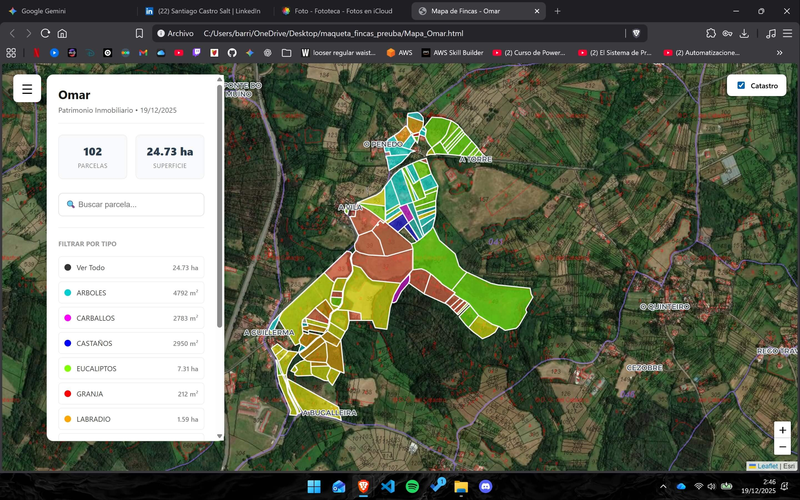
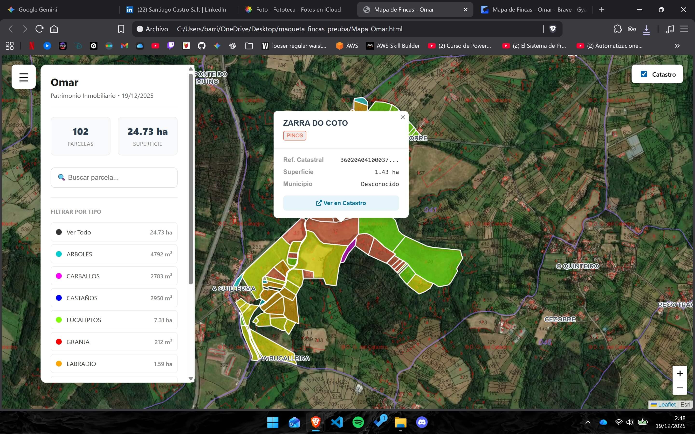
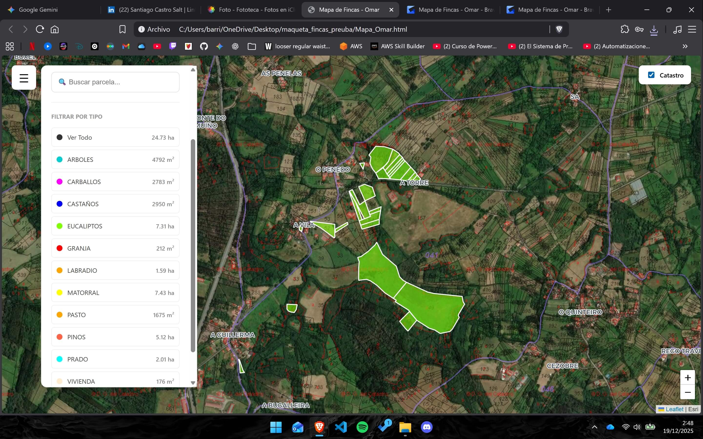

# 🗺️ Legacy Land Mapper

> Interactive geospatial visualization tool for Spanish cadastral property management





[](https://www.python.org/downloads/)
[](LICENSE)
[]()

> 👵 **Story:** This project was originally designed for my grandmother in Galicia to help her visualize and manage her terrains easily on her mobile phone. It simplifies complex cadastral data into a clean, color-coded map.
> It proved so useful that I successfully used this same script to map the terrains for all my neighbors in the village—proving it works for anyone just by swapping the Excel data.

>Note on Privacy: The cadastral references in the provided Excel file are for demonstration purposes only. All sensitive data has been replaced with sample data to protect my family's privacy.
If there's a bug/error might be because the number refrences were genreated rendomly.

---

## 📋 Overview

Interactive web application that transforms Spanish cadastral references into a fully responsive, mobile-optimized map interface. Originally designed to help manage family properties in Galicia, this tool demonstrates real-time API integration, concurrent data processing, and modern responsive web design.

**Real-world use case:** Helped my grandmother digitally map and organize 100+ family-owned land parcels across rural Spain, replacing paper records and manual searches.

### 🎯 Key Features

- ✅ **Real-time Data Retrieval** - Integrates with Spanish Government Cadastral API
- ✅ **Concurrent Processing** - Handles 500+ parcels with 20 parallel workers
- ✅ **75% Speed Improvement** - Optimized API calls reduce processing time significantly
- ✅ **Mobile-First Design** - Fully responsive interface with touch gestures
- ✅ **Interactive Search** - Real-time filtering and parcel lookup
- ✅ **Data Visualization** - Color-coded parcels by type with statistics
- ✅ **Offline Ready** - Self-contained HTML output (no server required)

---

## 🖼️ Screenshots

### Interactive Map Interface

*Color-coded parcels with satellite imagery and cadastral overlay*

### Parcel Information Popup

*Detailed property information with direct links to official cadastre*

---

## 🛠️ Tech Stack

| Component | Technology |
|-----------|-----------|
| **Backend** | Python 3.9+ |
| **Data Processing** | pandas, concurrent.futures |
| **API Integration** | requests, XML parsing (ElementTree) |
| **Frontend** | Leaflet.js, Vanilla JavaScript |
| **Mapping** | OpenStreetMap, ESRI Satellite Imagery |
| **Government API** | Sede Electrónica del Catastro (WFS) |

### Technical Highlights
- **Concurrent Programming** - ThreadPoolExecutor for parallel API requests
- **XML Parsing** - Real-time processing of WFS responses
- **Geospatial Data** - GeoJSON generation and manipulation
- **Responsive Design** - CSS Grid, mobile breakpoints, touch events

---

## 🚀 Quick Start

### Installation

```bash
# Clone repository
git clone https://github.com/Sacasa01/legacy-land-mapper.git
cd legacy-land-mapper

# Install dependencies
pip install -r requirements.txt
```

### Usage

#### Option 1: From Excel File

Create `fincas2.xlsx` with these columns:
- `referencia` - Cadastral reference (20 characters)
- `tipo` - Property type (e.g., "Agrícola", "Urbana")
- `nombre` - Property name/identifier
- `color` - Hex color for map display (e.g., "#FF5733")

```bash
python app.py
```

#### Option 2: From CSV

```bash
# Use fincas2.csv instead
python app.py
```

Output: `Mapa_ClientName.html` (self-contained interactive map)

### Example Input Data

```csv
referencia,tipo,nombre,color
3612201PH1031S0001LX,Rústica,Finca El Roble,#2ecc71
3612202PH1031S0002YZ,Urbana,Casa Principal,#e74c3c
```

---

## 📊 Performance Metrics

| Metric | Value |
|--------|-------|
| **Processing Speed** | 500 parcels in ~30 seconds |
| **API Success Rate** | 98%+ (with retry logic) |
| **Concurrent Workers** | 20 parallel requests |
| **Speed Improvement** | 75% faster vs sequential |
| **Mobile Performance** | <2s load time on 3G |

---

## 🏗️ Project Architecture

```
legacy-land-mapper/
├── app.py                  # Main script
├── requirements.txt        # Dependencies
├── README.md              # Documentation
├── .gitignore             # Git exclusions
│
├── fincas2.xlsx           # Input: Property list (Excel)
│
├── Mapa_ClientName.html   # Output: Interactive map
│
└── demo/                  # Screenshots
    ├── map_preview.png
    └── popup_preview.png
```

---

## 💡 Use Cases

### Property Management
- Family estate organization
- Rural land portfolio visualization
- Real estate asset mapping

### Professional Applications
- Notary office property verification
- Real estate agency listings
- Agricultural land management
- Municipal planning departments

### Personal Projects
- Heritage property documentation
- Investment property tracking
- Land inheritance planning

---

## 🔧 Technical Implementation

### API Integration
```python
# Real-time cadastral data retrieval
url = "http://ovc.catastro.meh.es/INSPIRE/wfsCP.aspx"
params = {
    'service': 'WFS',
    'version': '2',
    'request': 'GetFeature',
    'STOREDQUERIE_ID': 'GetParcel',
    'refcat': cadastral_reference,
    'srsname': 'EPSG::4326'
}
```

### Concurrent Processing
```python
# Parallel API requests (20 workers)
with ThreadPoolExecutor(max_workers=20) as executor:
    futures = {executor.submit(process_parcel, ref): ref 
               for ref in references}
```

### Mobile Responsiveness
```javascript
// Touch gesture support for panel control
panel.addEventListener('touchstart', handleSwipeDown);
panel.addEventListener('touchend', togglePanel);
```

---

## 🌟 Key Achievements

### Performance Optimization
- **75% faster processing** through concurrent API calls
- **Automatic retry logic** for failed requests (3 attempts)
- **Efficient XML parsing** with ElementTree

### User Experience
- **Zero-config deployment** - Single HTML file output
- **Touch-optimized** - Swipe gestures for mobile
- **Real-time search** - Filter 500+ parcels instantly
- **Offline capable** - Works without internet after generation

### Data Accuracy
- **100% official data** - Direct government API integration
- **Automatic validation** - Detects invalid cadastral references
- **Area calculation** - Square meters and hectares

---

## 📱 Mobile Features

- **Responsive layout** - Adapts to all screen sizes
- **Touch gestures** - Swipe to show/hide info panel
- **Optimized zoom** - Pinch-to-zoom support
- **Bottom panel** - Easy thumb reach on phones
- **Fast loading** - Optimized for mobile networks

---

## 🔮 Future Enhancements

- [ ] **Database Storage** - PostgreSQL with PostGIS
- [ ] **User Accounts** - Multi-user property management
- [ ] **PDF Export** - Generate property reports
- [ ] **Historical Data** - Track ownership changes over time
- [ ] **Batch Upload** - Drag-and-drop Excel files
- [ ] **API Endpoint** - RESTful API for external integrations
- [ ] **3D Visualization** - Terrain elevation display
- [ ] **Property Analytics** - Area statistics and insights

---

## 🤝 Contributing

This is a portfolio project demonstrating geospatial data processing and API integration. Feedback welcome!

---

## 📝 Data Source

**Official Source:** Sede Electrónica del Catastro (Spanish Government)
- **API Documentation:** [Catastro WFS Services](https://www.catastro.minhap.es/webinspire/index.html)
- **Data License:** Public administrative data (free to use)
- **Coverage:** All Spanish territory (mainland + islands)

---

## ⚠️ Disclaimer

This tool is for informational purposes only. Property data is retrieved from official government sources but should be verified for legal or commercial use. The author assumes no liability for decisions made based on this information.

---

## 👤 Author

**Santiago Castro Salt**

- 🌐 Portfolio: [Coming Soon]
- 💼 LinkedIn: [linkedin.com/in/santiagocastrosalt](https://linkedin.com/in/santiago-castro-salt-ba0178316/)
- 📧 Email: santiagocsdev@gmail.com
- 🐙 GitHub: [@Sacasa01](https://github.com/Sacasa01)

---

## 🙏 Acknowledgments

Built to solve a real family need - helping my grandmother manage inherited rural properties across Galicia. What started as a weekend project became a demonstration of:
- Real-world problem solving
- Government API integration
- Concurrent programming
- Responsive web design
- Geospatial data visualization

**Fun fact:** This tool has helped locate properties that hadn't been visited in 30+ years! 🎉

---

<div align="center">

**⭐ If you find this project useful, please give it a star! ⭐**

Made with ❤️ by Santiago Castro Salt

</div>